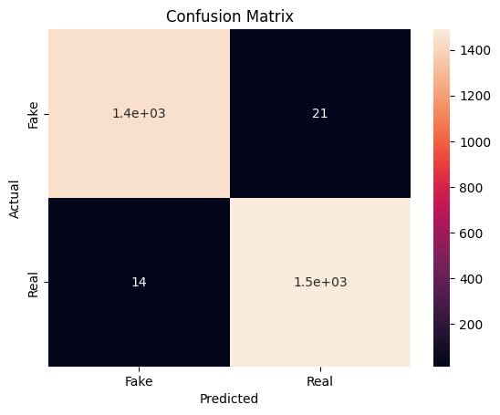

# 📰 Fake News Detection using Machine Learning

## 📌 Objective
Build a machine learning model to detect whether a given news article is **FAKE** or **REAL** based on its textual content.

---

## 📁 Dataset
- **Name:** `fake_and_real_news.csv`
- **Source:** Kaggle
- **Columns Used:**
  - `text`: Main content of the news article
  - `label`: Ground truth – 'FAKE' or 'REAL'

---

## 🔍 Steps Performed

1. **Data Cleaning:**
   - Removed missing or corrupted rows
   - Checked for duplicates

2. **Preprocessing:**
   - Label encoding: `'FAKE' → 0`, `'REAL' → 1`
   - Removed unused/unwanted columns

3. **Text Vectorization:**
   - Used `TfidfVectorizer` to convert text into numerical features

4. **Model Training:**
   - Used **Logistic Regression** to train on the transformed data

5. **Evaluation:**
   - Measured accuracy and visualized confusion matrix
   - Achieved excellent accuracy

---

## 📈 Results

- ✅ **Accuracy:** 98.8%  
- 📊 **Confusion Matrix:**



---

## 🚀 How to Run

### 📦 Requirements:
- Python 3.12
- Jupyter Notebook or VS Code with Jupyter extension
- Libraries: `pandas`, `sklearn`, `matplotlib`, `seaborn`

### ▶️ Run the notebook:
1. Clone the repo
2. Open `Fake_News_Detection.ipynb` in VS Code or Colab
3. Run all cells

### 🧪 Predict your own input:
Inside the notebook, use:
```python
predict_news("This just in: Government announces new economic reforms.")
